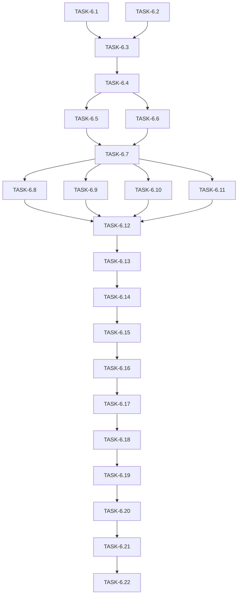

# Spec-6: ChatUI Frontend Integration Tasks

## Metadata
- **Spec**: 006-chatkit-frontend
- **Plan Reference**: specs/006-chatkit-frontend/plan.md
- **Generated**: 2025-12-18
- **Total Tasks**: 22
- **Estimated Total Effort**: M-L (16-24 hours)

## Task Dependency Graph



## Critical Path

```
TASK-6.1 -> TASK-6.3 -> TASK-6.4 -> TASK-6.5 -> TASK-6.7 -> TASK-6.12 -> TASK-6.13 -> TASK-6.14 -> TASK-6.15 -> TASK-6.16 -> TASK-6.17 -> TASK-6.18 -> TASK-6.19 -> TASK-6.20 -> TASK-6.21 -> TASK-6.22
```

**Critical Path Length**: 16 tasks

---

## Phase 1: Foundation (Environment & Types)

### TASK-6.1: Add uuid dependency to package.json

**Description:** Install the `uuid` package for generating UUID v4 session identifiers. This is required for client-side session ID generation per spec IC-004.

**Dependencies:** None

**Acceptance Criteria:**
- [X] `uuid` package added to dependencies in `physical-ai-robotics-book/package.json`
- [X] `@types/uuid` added to devDependencies for TypeScript support
- [X] `npm install` completes without errors
- [X] Package-lock.json updated with uuid entry

**Test Cases:**
1. Run `npm install` in `physical-ai-robotics-book/` - exits 0
2. Import `{ v4 as uuidv4 }` in a test file - compiles without error
3. Call `uuidv4()` - returns valid UUID v4 string

**Effort:** XS

---

### TASK-6.2: Add backendUrl to docusaurus.config.ts customFields

**Description:** Configure the backend URL using Docusaurus `customFields` pattern (NOT NEXT_PUBLIC_* which is Next.js only). This enables runtime access to backend URL from React components.

**Dependencies:** None

**Acceptance Criteria:**
- [X] `customFields` object added to `physical-ai-robotics-book/docusaurus.config.ts`
- [X] `backendUrl` field set to `process.env.BACKEND_URL || 'http://localhost:8000'`
- [X] Build completes without TypeScript errors
- [X] `npm run start` loads site with customFields accessible

**Test Cases:**
1. Run `npm run build` - exits 0
2. Access `siteConfig.customFields.backendUrl` in React component - returns expected URL
3. Set `BACKEND_URL=http://test:9000` env var, rebuild - customFields reflects new URL

**Effort:** XS

---

### TASK-6.3: Create TypeScript interfaces for chat types

**Description:** Create `src/types/chat.ts` with all TypeScript interfaces from data-model.md. These interfaces define the contract between frontend and backend.

**Dependencies:** TASK-6.1, TASK-6.2

**Acceptance Criteria:**
- [X] File created at `physical-ai-robotics-book/src/types/chat.ts`
- [X] `ChatRequest` interface with query, selected_text, session_id, filters fields
- [X] `ChatResponse` interface with answer, fallback_message, sources, metadata, session_id
- [X] `SourceCitation` interface with source_url, title, section, chunk_position, similarity_score, snippet
- [X] `ResponseMetadata` interface with query_time_ms, retrieval_count, mode, low_confidence, request_id
- [X] `HistoryEntry` interface with timestamp, query, response, sources
- [X] `HistoryResponse` interface with session_id, entries, total_entries
- [X] `ChatMessage` interface with id, role, content, timestamp, sources, isStreaming, error
- [X] `ChatState` interface with messages, isLoading, error, isOpen, mode, selectedText
- [X] `SessionState` interface with sessionId, isNewSession, storageAvailable
- [X] `SelectionContext` interface with text, sourceUrl, capturedAt
- [X] All interfaces export properly and compile without errors

**Test Cases:**
1. Import all interfaces in a test file - compiles without error
2. Create mock objects for each interface - type checks pass
3. `npm run typecheck` passes

**Effort:** S

---

### TASK-6.4: Create configuration service with useBackendUrl hook

**Description:** Create `src/services/config.ts` with static configuration constants and the `useBackendUrl()` hook that retrieves backend URL from Docusaurus context.

**Dependencies:** TASK-6.3

**Acceptance Criteria:**
- [X] File created at `physical-ai-robotics-book/src/services/config.ts`
- [X] `CONFIG` constant object exported with all configuration values:
  - REQUEST_TIMEOUT_MS: 30000
  - MAX_RETRIES: 3
  - RETRY_DELAY_MS: 1000
  - SESSION_STORAGE_KEY: 'chatui_session_id'
  - MAX_QUERY_LENGTH: 32000
  - MAX_SELECTION_LENGTH: 64000
  - MIN_SELECTION_LENGTH: 20
  - HISTORY_LIMIT: 50
- [X] `useBackendUrl()` hook implemented using `useDocusaurusContext()`
- [X] `DEFAULT_BACKEND_URL` constant exported for non-React contexts
- [X] Hook returns string URL from `siteConfig.customFields.backendUrl`
- [X] Fallback to 'http://localhost:8000' if customFields not configured

**Test Cases:**
1. Call `useBackendUrl()` in component - returns configured URL
2. Access `CONFIG.SESSION_STORAGE_KEY` - returns 'chatui_session_id'
3. Build completes without errors

**Effort:** S

---

## Phase 2: API Layer (Services & Hooks)

### TASK-6.5: Create API client with sendChatMessage function

**Description:** Create `src/services/chatApi.ts` with the non-streaming `sendChatMessage()` function that posts to `/chat` endpoint.

**Dependencies:** TASK-6.4

**Acceptance Criteria:**
- [X] File created at `physical-ai-robotics-book/src/services/chatApi.ts`
- [X] `sendChatMessage(backendUrl: string, request: ChatRequest): Promise<ChatResponse>` exported
- [X] Function sends POST request to `${backendUrl}/chat`
- [X] Request body JSON-serialized with Content-Type header
- [X] Successful response (200) returns parsed ChatResponse
- [X] Error responses (4xx/5xx) throw ChatApiError with error_code, message, status
- [X] Network errors caught and re-thrown with descriptive message

**Test Cases:**
1. Mock successful response - returns ChatResponse object
2. Mock 400 error - throws ChatApiError with VALIDATION_ERROR
3. Mock 429 error - throws ChatApiError with RATE_LIMITED
4. Mock network failure - throws with NETWORK_ERROR

**Effort:** S

---

### TASK-6.6: Add streaming support with streamChatMessage function

**Description:** Extend `chatApi.ts` with `streamChatMessage()` that handles SSE streaming from `/chat/stream` endpoint.

**Dependencies:** TASK-6.4

**Acceptance Criteria:**
- [X] `streamChatMessage()` function added to `physical-ai-robotics-book/src/services/chatApi.ts`
- [X] Function signature: `(backendUrl, request, onDelta, onSources, onError, onDone) => () => void`
- [X] Posts to `${backendUrl}/chat/stream` with JSON body
- [X] Parses SSE events (lines starting with `data: `)
- [X] Calls `onDelta(string)` for each `delta` event
- [X] Calls `onSources(SourceCitation[])` when sources event received
- [X] Calls `onError(string)` on error event or fetch failure
- [X] Calls `onDone()` when done event received
- [X] Returns abort function that cancels the fetch via AbortController
- [X] Handles AbortError gracefully (no callback)

**Test Cases:**
1. Mock stream with delta events - onDelta called for each
2. Mock stream with sources event - onSources called with array
3. Mock stream with done event - onDone called
4. Call abort function - stream cancelled, no callbacks after

**Effort:** M

---

### TASK-6.7: Add history retrieval with transformHistoryToMessages

**Description:** Add `getHistory()` and `transformHistoryToMessages()` functions to handle history API and transform backend format to UI format.

**Dependencies:** TASK-6.5, TASK-6.6

**Acceptance Criteria:**
- [X] `getHistory(backendUrl: string, sessionId: string): Promise<HistoryEntry[]>` added to chatApi.ts
- [X] GET request to `${backendUrl}/history/${sessionId}?limit=${CONFIG.HISTORY_LIMIT}`
- [X] Returns empty array on 404 (new session)
- [X] Throws ChatApiError on other errors
- [X] `transformHistoryToMessages(entries: HistoryEntry[]): ChatMessage[]` function added
- [X] Each HistoryEntry transformed into TWO ChatMessages (user + assistant)
- [X] User message: id=`${timestamp}-user`, role='user', content=entry.query
- [X] Assistant message: id=`${timestamp}-assistant`, role='assistant', content=entry.response, sources=entry.sources
- [X] Timestamps converted from ISO string to Date objects

**Test Cases:**
1. Mock 200 response with entries - returns HistoryEntry array
2. Mock 404 response - returns empty array
3. Transform 2 entries - returns 4 ChatMessages in correct order
4. Verify user message has no sources, assistant message has sources

**Effort:** S

---

## Phase 3: State Management (Hooks)

### TASK-6.8: Create useSession hook for localStorage management

**Description:** Create `src/hooks/useSession.ts` that manages session ID in localStorage with fallback for private browsing.

**Dependencies:** TASK-6.7

**Acceptance Criteria:**
- [X] File created at `physical-ai-robotics-book/src/hooks/useSession.ts`
- [X] `useSession(): SessionState` hook exported
- [X] On mount, checks localStorage for `chatui_session_id` key
- [X] If valid UUID v4 found, uses it (isNewSession: false)
- [X] If not found or invalid, generates new UUID v4 (isNewSession: true)
- [X] New session ID saved to localStorage
- [X] If localStorage unavailable (private browsing), generates in-memory UUID
- [X] `storageAvailable: false` when localStorage fails
- [X] UUID v4 validation regex: `/^[0-9a-f]{8}-[0-9a-f]{4}-4[0-9a-f]{3}-[89ab][0-9a-f]{3}-[0-9a-f]{12}$/i`

**Test Cases:**
1. Fresh browser - generates new UUID, isNewSession: true
2. Existing session - loads from localStorage, isNewSession: false
3. Private browsing (mock localStorage fail) - storageAvailable: false
4. Invalid UUID in storage - generates new, clears old

**Effort:** S

---

### TASK-6.9: Create useTextSelection hook for text selection capture

**Description:** Create `src/hooks/useTextSelection.ts` that captures text selections from book pages using the browser Selection API.

**Dependencies:** TASK-6.7

**Acceptance Criteria:**
- [X] File created at `physical-ai-robotics-book/src/hooks/useTextSelection.ts`
- [X] `useTextSelection(): { selection: SelectionContext | null, clearSelection: () => void }` exported
- [X] Listens for `mouseup` events on document
- [X] Uses `window.getSelection()` to capture selected text
- [X] Returns `SelectionContext` with text, sourceUrl (current page), capturedAt
- [X] Ignores selections < 1 character
- [X] `clearSelection()` resets state to null
- [X] Cleans up event listener on unmount
- [X] Uses `getBoundingClientRect()` for popup positioning (optional return)

**Test Cases:**
1. Select text on page - selection object populated
2. Click without selection - selection null
3. Call clearSelection - selection becomes null
4. Unmount component - event listener removed

**Effort:** S

---

### TASK-6.10: Create useChat hook with reducer-based state management

**Description:** Create `src/hooks/useChat.ts` implementing chat state with useReducer pattern per constraint FC-005 (no external state libraries).

**Dependencies:** TASK-6.7

**Acceptance Criteria:**
- [X] File created at `physical-ai-robotics-book/src/hooks/useChat.ts`
- [X] `useChat()` hook exported with full ChatState and actions
- [X] Uses `useReducer` with ChatAction union type
- [X] Actions: OPEN, CLOSE, SET_LOADING, ADD_MESSAGE, UPDATE_LAST_MESSAGE, SET_ERROR, SET_SELECTED_TEXT, LOAD_HISTORY
- [X] `sendMessage(query: string)` action that:
  - Adds user message immediately
  - Adds placeholder assistant message (isStreaming: true)
  - Calls `streamChatMessage()` with callbacks
  - Updates assistant message content on delta
  - Updates assistant message sources on sources event
  - Sets isStreaming: false on done
- [X] Loads history on mount via `getHistory()` + `transformHistoryToMessages()`
- [X] Returns: messages, isLoading, error, isOpen, mode, selectedText, sendMessage, open, close, setSelectedText, clearError

**Test Cases:**
1. Initial state - messages empty, isOpen false, mode 'full'
2. Call open() - isOpen becomes true
3. Call sendMessage - user message added, loading starts
4. Stream completes - assistant message populated, loading false
5. Set selected text - mode changes to 'selected_text'

**Effort:** M

---

### TASK-6.11: Add error handling utilities and ChatApiError class

**Description:** Create `src/services/errors.ts` with custom error classes and error-to-UI message mapping per spec Error-to-UI Mapping table.

**Dependencies:** TASK-6.7

**Acceptance Criteria:**
- [X] File created at `physical-ai-robotics-book/src/services/errors.ts`
- [X] `ChatApiError` class with error_code, message, status properties
- [X] `ERROR_MESSAGES` mapping from error codes to user-friendly messages:
  - VALIDATION_ERROR -> "Please enter a valid question."
  - RATE_LIMITED -> "Too many requests. Please wait a moment and try again."
  - SERVICE_UNAVAILABLE -> "The assistant is temporarily unavailable. Please try again."
  - INTERNAL_ERROR -> "Something went wrong. Please try again later."
  - CORS_ERROR -> "Unable to connect to the assistant. Please check your connection."
  - NETWORK_ERROR -> "Network error. Please check your internet connection."
  - TIMEOUT -> "Request timed out. Please try again."
- [X] `getErrorMessage(error: Error | ChatApiError): string` function
- [X] `isRetryableError(error: Error | ChatApiError): boolean` function

**Test Cases:**
1. ChatApiError with RATE_LIMITED - getErrorMessage returns rate limit message
2. Generic Error - getErrorMessage returns generic message
3. isRetryableError for 503 - returns true
4. isRetryableError for 400 - returns false

**Effort:** S

---

## Phase 4: UI Components

### TASK-6.12: Create ChatMessage component with markdown rendering

**Description:** Create `src/components/Chat/ChatMessage.tsx` that renders individual chat messages with markdown support and source citations.

**Dependencies:** TASK-6.8, TASK-6.9, TASK-6.10, TASK-6.11

**Acceptance Criteria:**
- [X] File created at `physical-ai-robotics-book/src/components/Chat/ChatMessage.tsx`
- [X] Accepts `message: ChatMessage` prop
- [X] Displays different styling for user vs assistant messages
- [X] Renders markdown content (code blocks, lists, emphasis) - can use react-markdown or dangerouslySetInnerHTML
- [X] Shows timestamp formatted nicely (e.g., "2:30 PM")
- [X] Shows loading indicator when `isStreaming: true`
- [X] Shows error styling when `error` is set
- [X] Exports component for use in ChatPanel
- [X] Uses Tailwind CSS for styling per constitution

**Test Cases:**
1. Render user message - correct styling applied
2. Render assistant message with markdown - code block renders
3. Render streaming message - loading indicator visible
4. Render message with error - error styling applied

**Effort:** S

---

### TASK-6.13: Create SourceCitations component for citation display

**Description:** Create `src/components/Chat/SourceCitations.tsx` that displays clickable source links from response.

**Dependencies:** TASK-6.12

**Acceptance Criteria:**
- [X] File created at `physical-ai-robotics-book/src/components/Chat/SourceCitations.tsx`
- [X] Accepts `sources: SourceCitation[]` prop
- [X] Renders each citation as clickable link with title
- [X] Shows section name as subtitle
- [X] Links open in same tab (internal book navigation)
- [X] Shows "No specific sources cited" if sources array empty
- [X] Shows "Based on your selection" for selected_text mode (mode prop)
- [X] Styled with Tailwind - compact, scannable list

**Test Cases:**
1. Render 3 sources - 3 clickable links appear
2. Click source link - navigates to source_url
3. Empty sources array - shows fallback message
4. Mode is selected_text - shows selection indicator

**Effort:** S

---

### TASK-6.14: Create ChatInput component with send button

**Description:** Create `src/components/Chat/ChatInput.tsx` with textarea and send button for user input.

**Dependencies:** TASK-6.13

**Acceptance Criteria:**
- [X] File created at `physical-ai-robotics-book/src/components/Chat/ChatInput.tsx`
- [X] Controlled textarea with value and onChange props
- [X] Send button triggers onSend callback
- [X] Enter key submits (Shift+Enter for newline)
- [X] Button disabled when input empty or isLoading
- [X] Shows character count near limit (32000)
- [X] Validates query length before submit
- [X] Shows inline error for validation failures
- [X] Auto-focuses on mount or when chat opens

**Test Cases:**
1. Type in textarea - value updates
2. Click send - onSend called with value
3. Press Enter - submits form
4. Empty input - button disabled
5. Exceed 32000 chars - validation error shown

**Effort:** S

---

### TASK-6.15: Create ChatPanel component with message list

**Description:** Create `src/components/Chat/ChatPanel.tsx` that combines message list, input, and header into the main chat interface.

**Dependencies:** TASK-6.14

**Acceptance Criteria:**
- [X] File created at `physical-ai-robotics-book/src/components/Chat/ChatPanel.tsx`
- [X] Header with title, mode indicator, close button
- [X] Scrollable message list using ChatMessage components
- [X] Auto-scroll to bottom on new messages
- [X] Error banner when error state set
- [X] ChatInput at bottom
- [X] Selected-text indicator when mode='selected_text'
- [X] "Clear selection" button in selected-text mode
- [X] Responsive: full-screen on mobile (< 768px), panel on desktop
- [X] Props: messages, isLoading, error, mode, selectedText, onSendMessage, onClose, onClearSelection

**Test Cases:**
1. Render with messages - all messages displayed
2. New message added - scrolls to bottom
3. Error set - error banner visible
4. Mobile viewport - full-screen overlay
5. Desktop viewport - floating panel

**Effort:** M

---

### TASK-6.16: Create ChatWidget with floating trigger button

**Description:** Create `src/components/Chat/ChatWidget.tsx` as the main entry point with floating trigger button and ChatPanel.

**Dependencies:** TASK-6.15

**Acceptance Criteria:**
- [X] File created at `physical-ai-robotics-book/src/components/Chat/ChatWidget.tsx`
- [X] Uses `useChat()` hook for all state management
- [X] Floating trigger button (bottom-right, fixed position)
- [X] Button shows chat icon (SVG or heroicon)
- [X] Button hidden when chat is open
- [X] ChatPanel rendered when isOpen is true
- [X] Smooth animation on open/close (optional)
- [X] z-index ensures widget is above page content
- [X] aria-label for accessibility

**Test Cases:**
1. Initial render - trigger button visible
2. Click trigger - chat panel opens
3. Close panel - trigger button visible again
4. Send message in panel - message appears

**Effort:** S

---

### TASK-6.17: Create barrel export index.ts for Chat components

**Description:** Create `src/components/Chat/index.ts` to export all chat components cleanly.

**Dependencies:** TASK-6.16

**Acceptance Criteria:**
- [X] File created at `physical-ai-robotics-book/src/components/Chat/index.ts`
- [X] Exports ChatWidget
- [X] Exports ChatPanel (for testing/customization)
- [X] Exports ChatMessage (for testing/customization)
- [X] Exports SourceCitations (for testing/customization)
- [X] Exports ChatInput (for testing/customization)

**Test Cases:**
1. `import { ChatWidget } from '../components/Chat'` - works
2. Build completes without errors

**Effort:** XS

---

## Phase 5: Text Selection Feature

### TASK-6.18: Create SelectionPopup component

**Description:** Create `src/components/TextSelection/SelectionPopup.tsx` that appears when text is selected on book pages.

**Dependencies:** TASK-6.17

**Acceptance Criteria:**
- [X] File created at `physical-ai-robotics-book/src/components/TextSelection/SelectionPopup.tsx`
- [X] Uses `useTextSelection()` hook
- [X] Shows "Ask about selection" button near selection
- [X] Positioned using selection bounding rect
- [X] Clicking button captures selection and opens chat
- [X] Passes captured text to chat via callback prop
- [X] Hidden when no text selected
- [X] Shows tooltip for selections < 20 chars: "Please select more text"
- [X] Styled as floating button with Tailwind

**Test Cases:**
1. No selection - popup hidden
2. Select text - popup appears near selection
3. Click "Ask about selection" - callback triggered with text
4. Short selection - tooltip warning shown

**Effort:** M

---

### TASK-6.19: Create barrel export for TextSelection components

**Description:** Create `src/components/TextSelection/index.ts` for clean imports.

**Dependencies:** TASK-6.18

**Acceptance Criteria:**
- [X] File created at `physical-ai-robotics-book/src/components/TextSelection/index.ts`
- [X] Exports SelectionPopup

**Test Cases:**
1. `import { SelectionPopup } from '../components/TextSelection'` - works

**Effort:** XS

---

## Phase 6: Integration

### TASK-6.20: Integrate ChatWidget and SelectionPopup into Layout

**Description:** Update `src/theme/Layout/index.tsx` to include ChatWidget and SelectionPopup globally on all pages.

**Dependencies:** TASK-6.19

**Acceptance Criteria:**
- [X] `physical-ai-robotics-book/src/theme/Layout/index.tsx` updated
- [X] ChatWidget imported and rendered after Layout
- [X] SelectionPopup imported and rendered for text selection
- [X] Selection handler connects SelectionPopup to ChatWidget
- [X] Chat opens in selected_text mode when "Ask about selection" clicked
- [X] No console errors on any page
- [X] Build completes successfully

**Test Cases:**
1. Navigate to any book page - chat trigger visible
2. Select text - popup appears
3. Click "Ask about selection" - chat opens with selection context
4. No console errors in dev tools

**Effort:** S

---

### TASK-6.21: Update backend CORS_ORIGINS for production

**Description:** Update backend `.env.example` and document required CORS configuration for production deployment.

**Dependencies:** TASK-6.20

**Acceptance Criteria:**
- [X] `backend/.env.example` updated with production domain in CORS_ORIGINS
- [X] Comment documenting all required origins:
  - http://localhost:3000 (Docusaurus dev)
  - http://localhost:5173 (Vite dev)
  - https://hackathon-i-physical-ai-humanoid-ro-dun.vercel.app (production)
- [X] README or deployment docs mention CORS configuration
- [X] No wildcard (*) in production origins per FR-028

**Test Cases:**
1. Backend starts with updated CORS_ORIGINS - no errors
2. OPTIONS preflight from production domain - returns 200
3. POST /chat from production domain - succeeds (no CORS error)

**Effort:** XS

---

## Phase 7: Verification

### TASK-6.22: Run E2E smoke test checklist

**Description:** Execute full smoke test checklist from plan.md to verify all integration points work.

**Dependencies:** TASK-6.21

**Acceptance Criteria:**
- [X] **UI Renders**: Chat button visible on any book page
- [X] **No CORS**: Submit question - no CORS errors in console
- [X] **Network Calls Succeed**: `/chat/stream` returns 200 with SSE events
- [X] **Chat Works**: Ask "What is inverse kinematics?" - response within 5s
- [X] **Citations Display**: Response shows clickable source links
- [X] **History Persists**: Close browser, reopen - previous messages loaded
- [X] **Selected-Text Works**: Select text -> Ask -> Response references only selection
- [X] **Error Handling**: Disconnect backend -> Submit -> User-friendly error shown
- [X] **Mobile Responsive**: 375px viewport - full-screen overlay, controls accessible
- [X] All 8 smoke test scenarios pass

**Test Cases:**
1. Open localhost:3000 - chat trigger visible
2. Submit question - streaming response appears
3. Click citation link - navigates to book section
4. Close browser tab, reopen - history loads
5. Select paragraph, click "Ask about selection", ask question - answer references selection
6. Stop backend, submit question - error message appears
7. Resize to 375px - chat becomes full-screen

**Effort:** M

---

## Summary

| Phase | Tasks | Effort | Description |
|-------|-------|--------|-------------|
| 1. Foundation | 6.1-6.4 | S | Environment setup, types, config |
| 2. API Layer | 6.5-6.7 | M | Backend communication |
| 3. State Management | 6.8-6.11 | M | Hooks for session, selection, chat state |
| 4. UI Components | 6.12-6.17 | M | React components |
| 5. Text Selection | 6.18-6.19 | M | Selection popup feature |
| 6. Integration | 6.20-6.21 | S | Layout wrapper, CORS |
| 7. Verification | 6.22 | M | Smoke tests |

**Total**: 22 tasks
**Estimated Effort**: 16-24 hours

## Verification Domain Coverage

| Domain | Tasks Covering |
|--------|---------------|
| **UI Renders** | 6.12, 6.13, 6.14, 6.15, 6.16, 6.18, 6.22 |
| **Network Calls Succeed** | 6.5, 6.6, 6.7, 6.22 |
| **CORS Passes** | 6.21, 6.22 |
| **History Persists** | 6.7, 6.8, 6.10, 6.22 |
| **Selected-Text-Only Works** | 6.9, 6.18, 6.20, 6.22 |

## Risks

| Risk | Impact | Mitigation |
|------|--------|------------|
| CORS errors on Vercel previews | Low | Test on production domain only |
| ChatUI React 19 compatibility | Low | Already installed and working |
| localStorage unavailable | Low | In-memory fallback in useSession |
